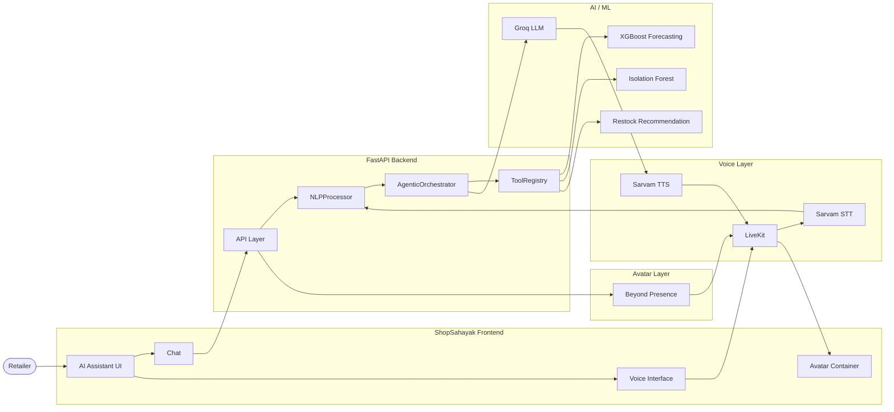
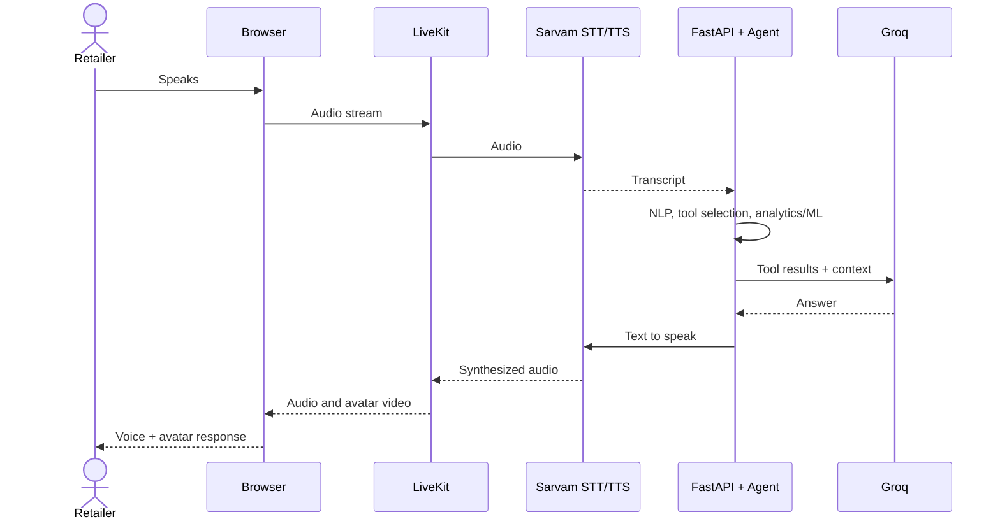
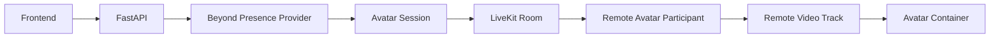
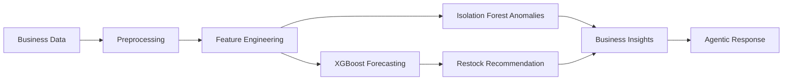

# ShopSahayak (షాప్‌సహాయక్ / शॉपसहायक)
## Production-Quality AI Business Assistant for Local Retail Stores


Built for the official Hackathon Problem Statement:  
> **"AI Business Assistant for Local Retail Stores"**  
> *"Instead of learning complicated business software, a shop owner can simply ask their business assistant what is happening and what needs attention."*

---


<div align="center">

# 🛍️ ShopSahayak

### AI-powered retail business assistant: ask your shop's data anything, by text or voice.

<!-- Badges: keep only the ones that match the repo -->


<!-- ⚠️ VERIFY: frontend badge (React / Next.js / Vue / plain JS?) -->


<!-- Replace with a real screenshot or GIF: docs/assets/demo.gif -->


[Demo Video](YOUR_DEMO_LINK) · [Report a Bug](https://github.com/YOUR_GITHUB_USERNAME/YOUR_REPO/issues) · [Request a Feature](https://github.com/YOUR_GITHUB_USERNAME/YOUR_REPO/issues)

</div>

---

## 📑 Contents

[Overview](#-overview) · [Problem](#-problem) · [Solution](#-solution) · [Features](#-key-features) · [How it works](#-how-shopsahayak-works) · [Architecture](#%EF%B8%8F-system-architecture) · [Implementation status](#-implementation-status) · [Tech stack](#%EF%B8%8F-tech-stack) · [API](#-api-reference) · [Setup](#%EF%B8%8F-setup) · [Testing](#-testing) · [Troubleshooting](#-troubleshooting) · [Structure](#-project-structure) · [Contributing](#-contributing)

---

## 🚀 Overview

**ShopSahayak** ("shop helper") is an AI business assistant for small and local retailers. Instead of navigating dashboards or spreadsheets, a shopkeeper asks a question in plain language, by typing or speaking, and gets a business-oriented answer grounded in their own sales and inventory data.

Under the hood, an **agentic orchestrator** interprets the question, selects the right business tools, runs analytics and ML models, and has an LLM turn the results into a clear response. The voice layer streams audio through **LiveKit** with **Sarvam** speech models, and an optional **Beyond Presence** avatar can speak the answer back.

**Built for:** shop owners, store managers, and small retail teams without a data analyst.

---

## 🎯 Problem

| Challenge | Impact on a small retailer |
|:--|:--|
| 🗂️ Fragmented business information | Sales, stock, and purchases live in different places |
| 📉 Hard-to-use analytics | BI tools assume technical skills and time |
| 📦 Inventory uncertainty | Stock-outs and over-stocking are guessed, not predicted |
| 🤖 Few accessible AI tools | Most AI products target large enterprises |
| 🧑‍💻 Technical barriers | Querying data usually means SQL or spreadsheet formulas |
| 🗣️ Language and voice barriers | Many owners prefer speaking, often mixing languages |

---

## 💡 Solution

```text
Natural Language  →  Business Intelligence  →  Actionable Insights

Voice  →  AI Understanding  →  Business Reasoning  →  Voice Response  →  Avatar Interaction
```

ShopSahayak puts one conversational interface in front of analytics, forecasting, anomaly detection, and restock logic, so the owner asks questions instead of operating software.

---

## ✨ Key Features

> Statuses are defined in [Implementation Status](#-implementation-status). ⚠️ Confirm each against the code before publishing.

| | Feature | Description | Status |
|:--:|:--|:--|:--:|
| 💬 | **Natural-language queries** | Ask about sales, stock, and products in plain language | ⚠️ VERIFY |
| 🧠 | **Agentic reasoning** | Orchestrator selects tools, gathers data, then reasons over results | ⚠️ VERIFY |
| 🛠️ | **Tool registry** | Business tools exposed to the orchestrator for tool calling | ⚠️ VERIFY |
| 📊 | **Business analytics** | Sales, inventory, low-stock detection, daily reports, top and slow-moving products | ⚠️ VERIFY each item |
| 📈 | **Demand forecasting** | XGBoost-based forecasting | ⚠️ VERIFY |
| 🚨 | **Anomaly detection** | Isolation Forest on business data | ⚠️ VERIFY |
| 🔁 | **Restock recommendations** | Suggested reorder actions from forecasts and stock levels | ⚠️ VERIFY |
| 🌐 | **Multilingual understanding** | Multilingual sentence embeddings in the NLP layer. Supported languages: `YOUR_VERIFIED_LANGUAGES` | ⚠️ VERIFY |
| 🎙️ | **Voice interaction** | Browser mic → LiveKit → Sarvam STT/TTS | ⚠️ VERIFY |
| 🧑‍🎤 | **Avatar** | Beyond Presence avatar rendered from a LiveKit video track | ⚠️ VERIFY: IMPLEMENTED / PARTIAL / CONFIGURED / BLOCKED |

---

## 🧠 How ShopSahayak Works

1. **Input.** The user types a query, or speaks into the browser microphone.
2. **Speech to text (voice only).** Audio travels over LiveKit and Sarvam STT transcribes it.
3. **NLP processing.** `NLPProcessor` handles language and intent, using multilingual semantic embeddings (`paraphrase-multilingual-MiniLM-L12-v2`) ⚠️ VERIFY.
4. **Agentic orchestration.** `AgenticOrchestrator` combines intent and context, picks tools from the `ToolRegistry`, and calls them.
5. **Analytics and ML.** Tools read business data and run analytics or models (forecasting, anomaly detection, restock logic).
6. **Generation.** Groq's LLM turns the tool results into a business-oriented answer.
7. **Output.** Text goes back to the UI. In voice mode, Sarvam TTS speaks it via LiveKit, and the Beyond Presence avatar can present it.

---

## 🏗️ System Architecture



### Voice sequence



### Avatar session



### ML pipeline



---

## 📋 Implementation Status

Legend: ✅ Implemented · 🟡 Partial · ⚙️ Configured · 🗓️ Planned · 🧱 Placeholder · ❌ Not implemented · ⛔ Blocked

| Component | Status | Evidence (file / module) |
|:--|:--:|:--|
| FastAPI backend | ⚠️ | `YOUR_PATH` |
| NLPProcessor | ⚠️ | `YOUR_PATH` |
| AgenticOrchestrator + ToolRegistry | ⚠️ | `YOUR_PATH` |
| Groq integration | ⚠️ | `YOUR_PATH` |
| Analytics tools | ⚠️ | `YOUR_PATH` |
| XGBoost forecasting | ⚠️ | `YOUR_PATH` |
| Isolation Forest anomaly detection | ⚠️ | `YOUR_PATH` |
| Restock recommendation | ⚠️ | `YOUR_PATH` |
| LiveKit voice transport | ⚠️ | `YOUR_PATH` |
| Sarvam STT / TTS | ⚠️ | `YOUR_PATH` |
| Beyond Presence avatar | ⚠️ | `YOUR_PATH` |
| Automated tests | ⚠️ | `YOUR_PATH` |
| Deployment configuration | ⚠️ | Not verified. Document only what exists in the repo |

> Performance, accuracy, latency, and production readiness have **not been benchmarked or verified** in this README.

---

## 🛠️ Tech Stack

| Layer | Technologies |
|:--|:--|
| **Backend** | Python 3.11, FastAPI, Pydantic v2 |
| **AI / GenAI** | Groq LLM, agentic orchestration with tool calling, sentence-transformers (`paraphrase-multilingual-MiniLM-L12-v2`) |
| **ML / Data** | XGBoost, scikit-learn (Isolation Forest), pandas, NumPy |
| **Voice** | LiveKit, Sarvam STT, Sarvam TTS |
| **Avatar** | Beyond Presence |
| **Frontend** | `YOUR_FRONTEND_STACK` ⚠️ read `package.json` |
| **Testing** | pytest, plus `YOUR_OTHER_TOOLS` |
| **Deployment** | `YOUR_VERIFIED_CONFIG_OR_"Not configured"` |

---

## 🔌 API Reference

> ⚠️ Replace with the real routes. Run the backend and open `/docs` (FastAPI's Swagger UI), then copy from there.

| Method | Endpoint | Purpose |
|:--|:--|:--|
| `POST` | `YOUR_CHAT_ROUTE` | Send a text query, receive a structured business response |
| `POST` | `YOUR_LIVEKIT_TOKEN_ROUTE` | Issue a LiveKit access token for the voice session |
| `POST` | `YOUR_AVATAR_ROUTE` | Start a Beyond Presence avatar session |
| `GET` | `YOUR_HEALTH_ROUTE` | Health check |

Example request (adjust to your schema):

```bash
curl -X POST http://localhost:8000/YOUR_CHAT_ROUTE \
  -H "Content-Type: application/json" \
  -d '{"message": "Which products are low on stock?"}'
```

---

## ⚙️ Setup

### Prerequisites

- Python 3.11
- Node.js `YOUR_VERSION` ⚠️ (for the frontend)
- Accounts and keys for Groq, Sarvam, LiveKit, and Beyond Presence

### 1. Clone

```bash
git clone https://github.com/YOUR_GITHUB_USERNAME/YOUR_REPO.git
cd YOUR_REPO
```

### 2. Backend

```bash
cd YOUR_BACKEND_DIR
python -m venv .venv
source .venv/bin/activate        # Windows: .venv\Scripts\activate
pip install -r requirements.txt
cp .env.example .env             # then fill in your own keys
uvicorn YOUR_APP_MODULE:app --reload --port 8000
```

### 3. Frontend

```bash
cd YOUR_FRONTEND_DIR
npm install
npm run dev
```

### Environment variables

> Match these names to your real `.env.example`. **Never commit `.env`.**

| Variable | Purpose |
|:--|:--|
| `GROQ_API_KEY` | Groq LLM access |
| `SARVAM_API_KEY` | Sarvam STT / TTS |
| `LIVEKIT_URL` | LiveKit server URL |
| `LIVEKIT_API_KEY` | LiveKit API key |
| `LIVEKIT_API_SECRET` | LiveKit API secret |
| `YOUR_BEYOND_PRESENCE_KEY_NAME` | Beyond Presence avatar access |

---

## 🧪 Testing

```bash
pytest -q
```

⚠️ VERIFY: list which areas the tests cover (NLP, tools, ML, API). Don't claim coverage numbers unless you've measured them.

---

## 🩺 Troubleshooting

| Symptom | Likely cause | Fix |
|:--|:--|:--|
| Backend won't start | Missing env vars or wrong Python version | Compare `.env` with `.env.example`, use Python 3.11 |
| First query is slow | Embedding model downloads or loads on first use | Wait for the initial load, then retry |
| No voice response | Invalid LiveKit or Sarvam credentials | Recheck keys and the LiveKit URL |
| Mic not working | Browser permission denied or insecure origin | Allow microphone access, use `localhost` or HTTPS |
| Avatar not appearing | Avatar session not started or key invalid | Check backend logs and the Beyond Presence config |
| CORS errors | Frontend origin not allowed in the backend | Add the frontend URL to the CORS settings |

---

## 📁 Project Structure

> Replace this with real output: run `tree -L 2 -I "node_modules|.venv|__pycache__"`

```text
YOUR_REPO/
├── backend/          # FastAPI app, NLP, agent, tools, ML
├── frontend/         # AI assistant UI, voice and avatar logic
├── tests/            # pytest suite
├── docs/             # documentation and assets
├── .env.example
└── README.md
```

---

## 🗺️ Roadmap

- [ ] `YOUR_PLANNED_ITEM_1`
- [ ] `YOUR_PLANNED_ITEM_2`

List only what you really intend to build, and keep anything unfinished out of Key Features.

---

## 🤝 Contributing

1. Fork the repo and create a branch: `git checkout -b feature/your-feature`
2. Make your changes and add tests
3. Run `pytest` before committing
4. Open a pull request describing the change

---

## 🔐 Security

Never commit API keys, tokens, or `.env` files. If you find a vulnerability, please report it privately to `YOUR_EMAIL@example.com`.

## 📄 License

Distributed under the `YOUR_LICENSE` license. See `LICENSE` for details.


<div align="center">

⭐ If ShopSahayak is useful or interesting to you, consider starring the repo.


## 📸 Screenshots & Visual Walkthrough

### 1. Store Executive Dashboard
*Real-time KPIs, interactive 7D/30D/3M SVG Revenue chart, stacked Inventory Health progress bar, and AI Business Insights.*


### 2. AI Command Center with Agentic Execution
*Natural language code-mixed conversation (`"Anna, rice stock entha undi?"`), live tool activity timeline, formula calculations, and one-click purchase orders.*


### 3. Customer Khata (Credit Ledger) Profile Drawer
*Customer purchase history, outstanding Udhar balances, order frequency, and predictive AI purchase pattern insights.*


---

## 🌟 Core Features

- **Store & Profile Management:** Configured for local Indian retail (Sharma Kirana Store, GSTIN, Address, UPI ID, Opening hours).
- **Product Catalogue Management:** Complete SKU codes, categories (*Grains, Flours, Oils, Dal, Dairy, Spices, Home Care*), wholesale buy prices, retail sell prices, and quick Add Product modal.
- **Inventory & Stock Tracking:** Real-time stock counts, safety minimums, daily sales velocity (e.g. `9.3 kg/day`), and instant AI Restock Recommendations.
- **AI Business Command Center:** Autonomous agentic tool execution timeline showing step-by-step progress (*Checking inventory... ✓*, *Analyzing sales... ✓*, *Calculating demand... ✓*, *Generating PO... ✓*).
- **Voice AI (LiveKit Integration Ready):** Interactive voice mode with central microphone button, audio waveform visualizer, states (*Tap to speak*, *Listening...*, *Understanding...*, *Responding...*), and audio interrupt.
- **Beyond Presence Avatar Panel:** Professional, calm retail business assistant avatar with speaking glow animation and synchronized speech captions.
- **Multilingual & Code-Mixed Speech:** Global language switcher supporting **English**, **Telugu (తెలుగు)**, and **Hindi (हिंदी)**, with automated detection of mixed dialects (e.g., *"Anna, rice stock entha undi?"*).
- **Sales & Transaction Management:** Daily transactions ledger, payment mode breakdown (*UPI PhonePe/GPay, Cash, Khata*), and POS quick billing modal.
- **Customer Information & Khata:** Track regular customers, ledger balances, lifetime spend, and automated WhatsApp reminder hooks.
- **Supplier & Distributor Management:** Supplier directories (*ABC Distributors, Balaji Trading Co, Sri Lakshmi Wholesalers, Amul Co-op Depot*), pending purchase orders, and direct reorder triggers.
- **Analytics & Executive Reports:** 6 specialized analytics modules, daily/weekly AI business summaries, and 1-click **Export to CSV, Excel, and Printable PDF**.
- **Role-Based Access Control (RBAC):** Switchable permission matrix (*Owner, Manager, Staff, Viewer*) protecting sensitive financial metrics and settings.
- **Security UX:** 2-step verification dialog for high-impact financial actions (*"Create purchase order for ₹5,400?"*).

---

## 🎯 The 13-Step Hackathon Demo Flow (Built-in)

An interactive walkthrough banner at the top of the interface allows evaluators to execute or auto-play the complete 13-step demonstration:

1. **Owner logs in:** Ravi Sharma (Owner) session activates.
2. **Dashboard overview:** Displays revenue (₹18,450), orders (47), estimated profit (₹2,723 • 14.8%), and low stock (7).
3. **AI insight triggers:** Flags *"7 products are below minimum stock level. Rice demand increased +21%"*.
4. **Owner opens AI Assistant:** Launches the dedicated ShopSahayak Command Center.
5. **Owner speaks via Voice:** Asks: *"Anna, rice stock entha undi?"*.
6. **LiveKit handles stream:** Voice waveform animates, language detected as *"Telugu + English"*.
7. **AI responds:** *"You currently have 18 kg of rice. Current stock may run low in 48 hours."*
8. **Agentic tool execution:** Visual execution timeline checks inventory, audits 30-day velocity (9.3 kg/day), and projects stockout.
9. **Recommendation generated:** Recommends ordering 100 kg from ABC Distributors for ₹5,400.
10. **Owner approves order:** Approves order via 2-step security confirmation dialog.
11. **Order confirmed:** Purchase order PO-8831 transmitted to ABC Distributors.
12. **Inventory updates live:** Rice stock automatically increases from 18 kg to 118 kg across the store.
13. **Updated business insights:** Low stock alert count drops from 7 to 6, rice status becomes Healthy, and updated executive report is compiled.

---

## 💻 Tech Stack & Architecture

- **Core:** HTML5 + Modular Vanilla JavaScript (ES6+ Pub/Sub reactive store).
- **Styling:** Custom Vanilla CSS Design System (**Bharat Mercantile Precision**) adhering to Linear/Stripe calm B2B SaaS principles.
- **Audio & Voice:** Web Speech API (Recognition & SpeechSynthesis) + Web Audio API visualizer.
- **Export Engine:** Client-side Data URI Blobs for instant CSV & Excel downloads + Printable CSS media query for PDF generation.
- **Zero Build Friction:** Runs directly in any modern browser without heavy node_modules dependencies.

---

## 🚀 Quick Start

1. **Clone the repository:**
   ```bash
   git clone https://github.com/Chaithanyarajpeddireddy-lgtm/ShopSahayak-AI-Retail-Assistant.git
   cd ShopSahayak-AI-Retail-Assistant
   ```

2. **Run locally:**
   Simply open `index.html` in any modern web browser:
   - On Windows: Double-click `index.html` or run `start index.html`
   - Or serve with any static server:
     ```bash
     npx serve .
     # or
     python -m http.server 8080
     ```

3. **Experience the Demo:**
   Click the **"Interactive Demo"** button on the top bar or use the step controls to run through the entire hackathon demo flow!


   

---

## 📄 License

This project is licensed under the MIT License.


</div>
